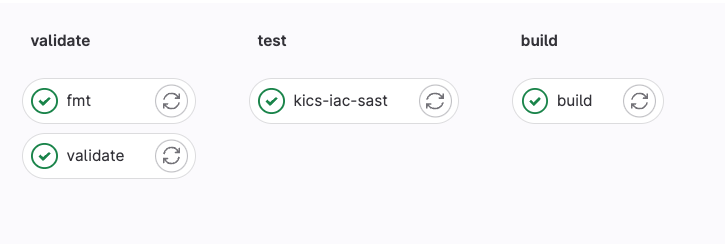
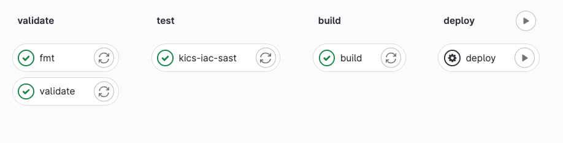

# Gitlab Pipelines

Now lets setup a gitlab pipeline to run Terraform!

## .gitlab-ci.yml

!!! info
    Gitlab pipelines are configured via a yaml file called `.gitlab-ci.yml`

First step is we will need to configure our `.gitlab-ci.yml`

!!! tip
    Gitlab also needs to access your AWS account. There are several ways to do this. The easiest being setting CI/CD variables for `AWS_ACCESS_KEY_ID` and `AWS_SECRET_ACCESS_KEY`. However, there are more secure ways and your client may have already integrated AWS with Gitlab

Configure below in `.gitlab-ci.yml` file

```yml
include:
  - template: Terraform.latest.gitlab-ci.yml
```

Wait, that is it? Yes. Gitlab has all the jobs necessary in the above template

Ok lets push this to gitlab and see what happens

```bash
git checkout -b feature/demo-gitlab
git commit -am"fix: add .gitlab-ci.yml"
git push gitlab
```

You should see



Gitlab runs these jobs
  
- validate: `terraform validate`
- fmt: `terraform fmt`
- kics-iac-sast: a static scan for IaC code
- build: `terraform plan`

!!! warning
    It runs a plan successfully but terraform wants to re-create all the resources
    
Terraform doesn't know about the resources we have created because we have been using local state. Lets fix that!

## Configure gitlab to use remote backend

In `main.tf` update the `terraform` block to include the below. This tells terraform to use http backend to store state

```
  backend "http" {
  }
```

Now we need to migrate local state to gitlab. You need to create a gitlab personal access token to do this, see <https://docs.gitlab.com/ee/user/profile/personal_access_tokens.html>

!!! note
    Token needs to have `api` scope

Use the script below setting the `PROJECT_ID` to the corresponding gitlab project and `TF_USERNAME` to your gitlab username

```bash
PROJECT_ID="45873656"
TF_USERNAME="travis.redfield"
TF_PASSWORD="$(pass /work/slalom/gitlab/travis.redfield/token)"
TF_ADDRESS="https://gitlab.com/api/v4/projects/${PROJECT_ID}/terraform/state/default"

terraform init \
  -backend-config=address=${TF_ADDRESS} \
  -backend-config=lock_address=${TF_ADDRESS}/lock \
  -backend-config=unlock_address=${TF_ADDRESS}/lock \
  -backend-config=username=${TF_USERNAME} \
  -backend-config=password=${TF_PASSWORD} \
  -backend-config=lock_method=POST \
  -backend-config=unlock_method=DELETE \
  -backend-config=retry_wait_min=5
```

You should see similar output. When terraform asks to copy your local state to new "http" backend answer `yes`

```bash
Initializing the backend...
Do you want to copy existing state to the new backend?
  Pre-existing state was found while migrating the previous "local" backend to the
  newly configured "http" backend. No existing state was found in the newly
  configured "http" backend. Do you want to copy this state to the new "http"
  backend? Enter "yes" to copy and "no" to start with an empty state.

  Enter a value: yes


Successfully configured the backend "http"! Terraform will automatically
use this backend unless the backend configuration changes.

Initializing provider plugins...
- Reusing previous version of hashicorp/tls from the dependency lock file
- Reusing previous version of hashicorp/aws from the dependency lock file
- Using previously-installed hashicorp/tls v4.0.4
- Using previously-installed hashicorp/aws v4.66.1

Terraform has been successfully initialized!
```

Now push updated files to gitlab

```bash
git commit -am"fix: updating remote backend"
git push gitlab
```

Now gitlab should show no changes in the plan because it has the correct state

## Add a new resource and apply with gitlab

Lets add a new resource and let gitlab apply it

First add below to `main.tf`. This will create and `S3` bucket

```hcl
# create an S3 bucket
resource "aws_s3_bucket" "example" {
  bucket = "terraform-lnl-test-bucket"

  tags = {
    Name = "TerraformDemo"
  }
}
```

Push to gitlab

```bash
git commit -am"fix: configure s3 bucket"
git push gitlab
```

The plan in gitlab should show creating an S3 bucket

```bash
Plan: 1 to add, 0 to change, 0 to destroy.
```

Create a merge request and merge to main. The pipeline should look like below



The `deploy` job runs `terraform apply`. It is manual job. Click play button to run it. The output should show

```bash
aws_s3_bucket.example: Creating...
aws_s3_bucket.example: Creation complete after 3s [id=terraform-lnl-test-bucket]
Apply complete! Resources: 1 added, 0 changed, 0 destroyed.
```