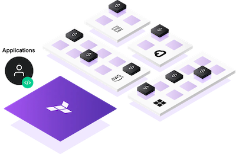

# Welcome to Terraform+Gitlab Lunch and Learn

For source code visit [https://gitlab.com/slalom-test/terraform-lnl](https://gitlab.com/slalom-test/terraform-lnl)

We will cover the following topics:

{ align=right }

- The what and why of Terraform
- Terraform 101
- How to setup terraform locally with AWS
- Create your first terraform project
- Expand on the above project
- Integrate your project into gitlab

## Project layout

    main.tf             # Initial terraform configuration
    outputs.tf          # Initial outputs file
    .gitlab-ci.yml      # Gitlab ci yaml for gitlab pipelines
    mkdocs.yml          # mkdocs configuration
    .terraform.lock.hcl # Terraform lock file
    final-tf-files/     # Final tf files
    docs/
        index.md    # The documentation homepage.
        ...         # Other markdown pages, images and other files.
