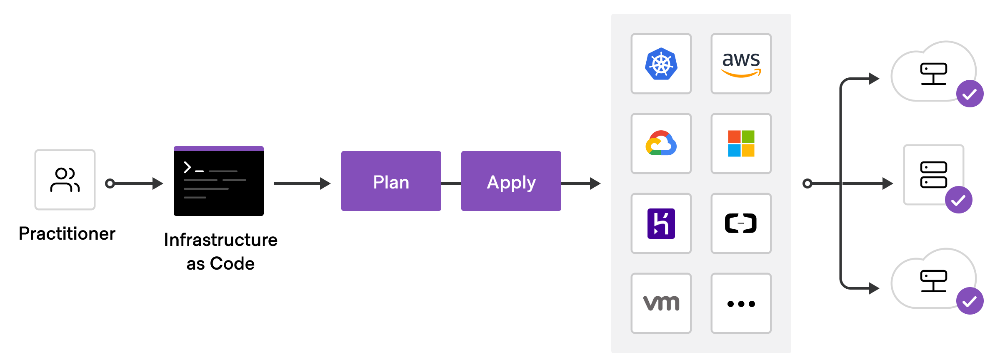

# Terraform 101

## Terraform HCL

Terraform is written in HCL (Hashicorp Configuration Language). Which is very JSON like but more human readable

An example resource to create an EC2 instance

```hcl
resource "aws_instance" "app_server" {
  ami           = "ami-830c94e3"
  instance_type = "t2.micro"

  tags = {
    Name = "TerraformDemo"
  }
}
```

## Terraform Basic Workflow

{==



==}

- You write your infrastructure in configuration files (.tf files)
- You run the "init" command to initialize terraform
- You run the “plan” command
    - Terraform analyzes the infrastructure compared to your configuration and creates a plan that will create, update, or destroy resources as necessary
- After reviewing the plan, you run the “apply” command. Terraform executes the plan

## Terraform State

The primary purpose of Terraform state is to store bindings between objects in a remote system and resource instances declared in your configuration

- keep track of metadata
- determine which changes to make to your infrastructure
- improve performance for large infrastructures

!!! tip
    Remote state allows teams to work together while using remote locking as a measure to avoid two or more different users accidentally running Terraform at the same time, and thus ensure that each Terraform run begins with the most recent updated state.

## Terraform Providers and Modules

- **Providers** are the plugins that Terraform uses to manage resources. Every supported service or infrastructure platform has a provider that defines which resources are available and performs API calls to manage those resources.
- **Modules** are reusable Terraform configurations that can be called and configured by other configurations. Most modules manage a few closely related resources from a single provider. You can create your own modules or use modules from the Terraform registry


!!! note
    We won't cover modules but they are a great way create re-useable building blocks when creating your infrastructure and highly encourage you to learn about modules